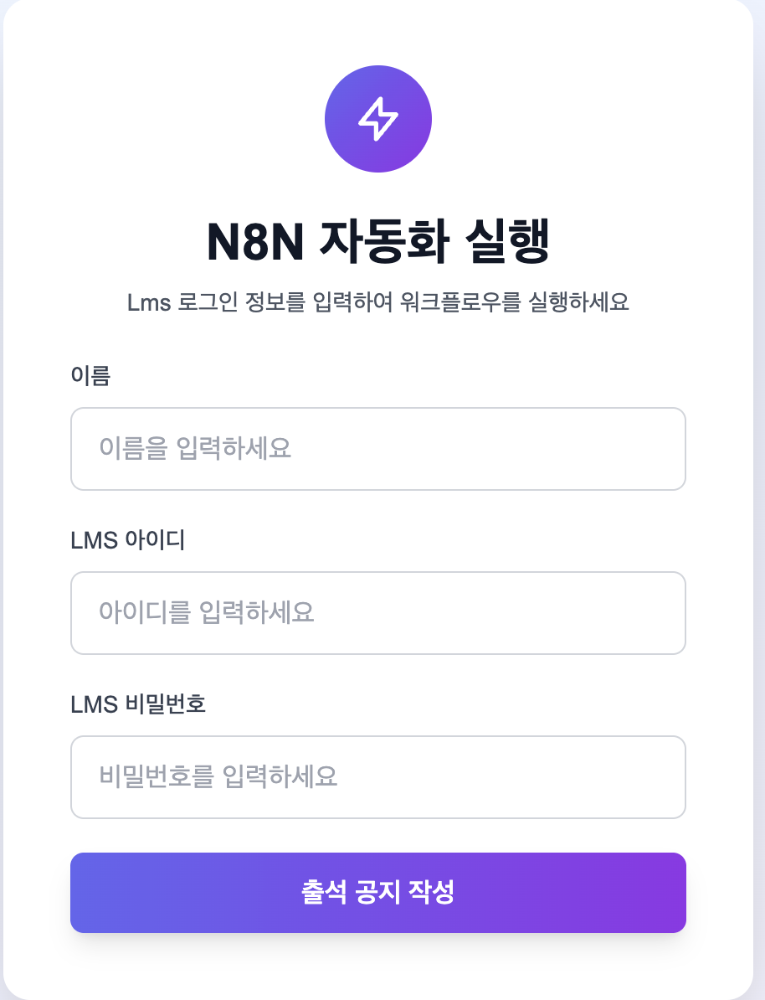
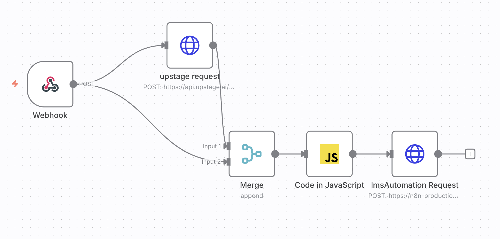
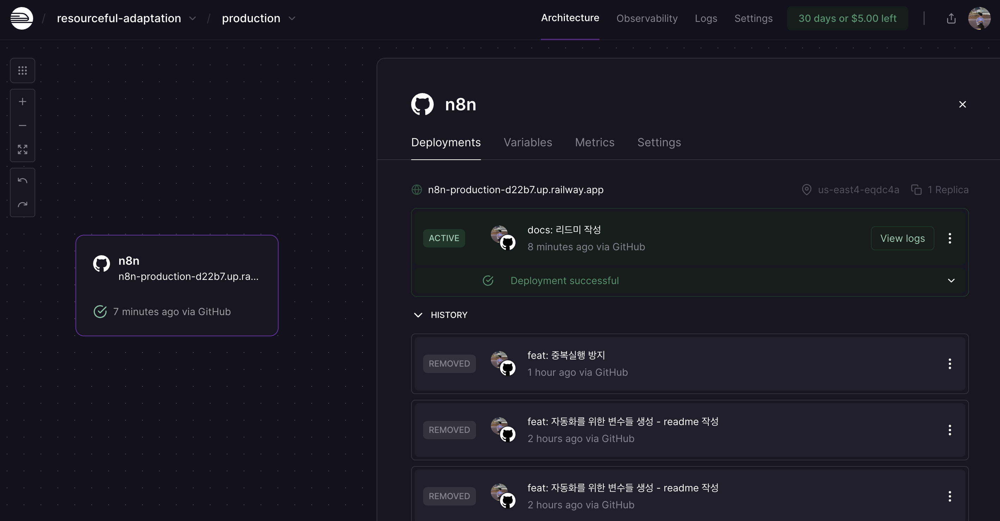
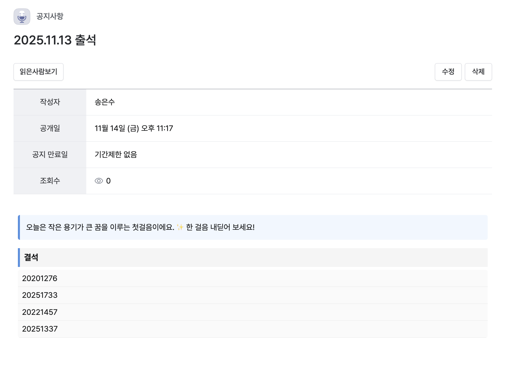

## n8n 프로세스
```
        ┌──────────────────────┐
        │   웹 페이지 버튼 클릭    |
        └───────────┬──────────┘
                    ▼
             ┌──────────────┐
             │   Webhook    │
             └──────┬───────┘
                    │
          ┌─────────┴──────────┐
          │                    │
          ▼                    ▼
 ┌────────────────┐    ┌────────────────────┐
 │ upstage request│    │   (same webhook)   │
 │   (HTTP POST)  │    │      body data     │
 └───────┬────────┘    └──────────┬─────────┘
        │                          │
        └────────────┬─────────────┘
                     ▼
              ┌────────────┐
              │   Merge     │
              │  (append)   │
              └──────┬──────┘
                     ▼
            ┌────────────────-──┐
            │ Code in JavaScript│
            └─────────┬───────-─┘
                      ▼
       ┌─────────────────────────────┐
       │  LmsAutomation Request      │
       │       (HTTP POST)           │
       └───────────┬─────────────────┘
                   ▼
        ┌────────────────────────┐
        │         공지 등록        │
        └────────────────────────┘


```

### 1. 클라이언트 버튼



[클라이언트 링크](https://n8n-zy2r.vercel.app/)

github와 vercel을 연동해 배포 [깃허브 링크](https://github.com/songess/n8n_front)

이름, 학번, 비번을 입력하고 버튼을 누르면 n8n webhook 트리거

### 2. n8n Webhook



요청을 받으면 2개의 노드 실행.

[n8n링크](https://primary-production-b57a.up.railway.app/workflow/I8FRzpgXHxRXHDnY) (아이디/비번은 톡방에 민석이가 써줌)

첫번째로 upstage API 호출. 포춘쿠키에 대한 정보를 가져옴.

두번째로 원본 데이터(이름, 학번, 비번)

### 3. Merge, JavaScript
두 데이터를 Merge 노드에 넘기고 JavaScript노드를 통해 병합하여 LmsAutomation서버에 요청 전달

### 4. LmsAutomation서버



[서버링크](https://railway.com/project/73843b34-4c59-4e50-b622-b3e5cae2ec17?environmentId=6d5a6d94-126a-4e10-b7b8-11350f70b241) (이건 내 깃허브 서버라 접근은 따로 안될듯..)

github와 railway를 연동해 배포 [서버 깃허브 링크](https://github.com/songess/n8n)

요청을 처리하여 공지 등록




